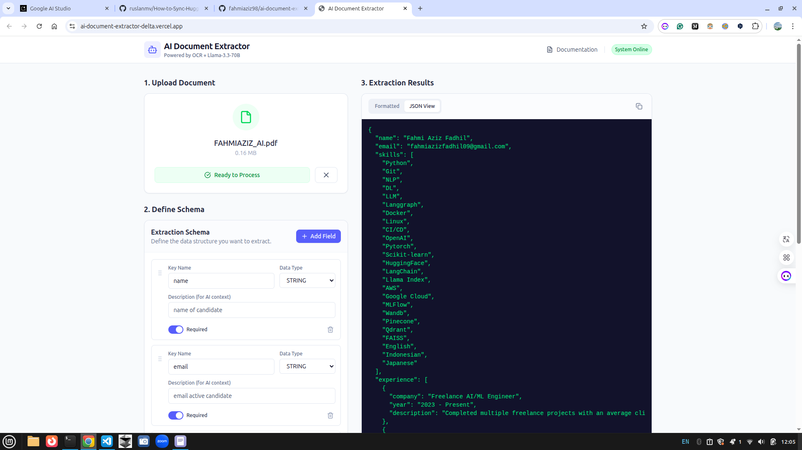

# AI Document Extractor 📄

A modern, full-stack application for Intelligent Document Processing (IDP). Define custom data schemas, upload documents (PDF/Images), and extract structured data using AI-powered OCR and LLM services.

## 🎯 Features
- **Dynamic Schema Builder**: Define fields, data types, and descriptions on the fly
- **Drag & Drop Upload**: Supports PDF, JPG, PNG, WEBP formats
- **AI Extraction**: Powered by RapidOCR + Groq (llama3.3-70B)
- **Results Viewer**: Syntax highlighted JSON and formatted data tables
- **FastAPI Backend**: High-performance, production-ready API
- **Rate Limiting**: Built-in request throttling with slowapi

## 🛠️ Tech Stack

### Frontend
- **Framework**: React 19 + Vite
- **Styling**: Tailwind CSS
- **Icons**: Lucide React
- **Language**: TypeScript

### Backend
- **Framework**: FastAPI 0.118+
- **Server**: Uvicorn
- **OCR**: RapidOCR (ONNX Runtime)
- **LLM**: Groq API (llama3.3-70B)
- **Image Processing**: Pillow, OpenCV, pdf2image

---

## 🚀 Quick Start

### 1. Clone Repository

```bash
# Fork (optional, if you want to contribute)
# Visit: https://github.com/fahmiaziz98/ai-document-extractor

# Clone
git clone https://github.com/fahmiaziz98/ai-document-extractor.git
cd ai-document-extractor
```

### 2. Setup Backend & Frontend

**Backend Setup:** See [`backend/README.md`](./backend/README.md)
```bash
cd backend
uv sync
make run
```

**Frontend Setup:** See [`frontend/README.md`](./frontend/README.md)
```bash
cd frontend
npm install
npm run dev
```

---

## 📚 Documentation

- **[Backend Setup](./backend/README.md)** - FastAPI, Python, OCR & LLM integration
- **[Frontend Setup](./frontend/README.md)** - React, TypeScript, Component guide
- **[API Docs](http://localhost:8000/docs)** - Interactive Swagger UI (when backend running)

---

## 📝 Project Structure

```
ai-document-extractor/
├── backend/          # FastAPI backend service
│   └── README.md    # Backend documentation
├── frontend/         # React frontend application
│   └── README.md    # Frontend documentation
└── README.md        # This file
```

### Demo UI


---

## 🐳 Docker Setup

```bash
# Run with Docker Compose
docker-compose up --build
```

---

## 🤝 Contributing

1. Fork the repository
2. Create feature branch: `git checkout -b feature/your-feature`
3. Commit changes: `git commit -am 'Add feature'`
4. Push: `git push origin feature/your-feature`
5. Submit PR

---

## 📄 License

MIT License - see LICENSE file for details

---

## 📧 Support

- 🐛 [Issues](https://github.com/fahmiaziz98/ai-document-extractor/issues)
- 💬 [Discussions](https://github.com/fahmiaziz98/ai-document-extractor/discussions)
- 📖 Backend API docs at `http://localhost:8000/docs`
